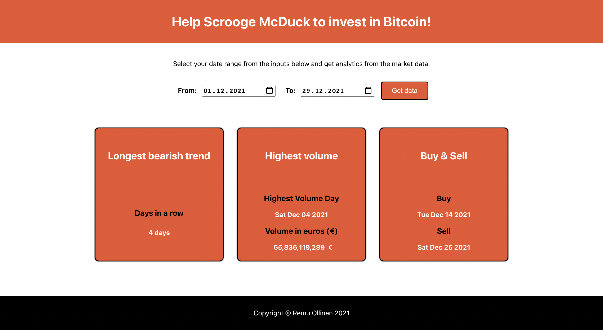

# Bitcoin market analysis tool

- A small bitcoin application made with React
- Cryptocurrency data fetched from [CoinGecko](http://coingecko.com/en/api) API

## Functionalities

- Calculate longest bearish (downward) trend in given date range
- Find trading day with the highest volume in given date range and the volume in euros
- Find the best days to buy and sell bitcoin in a given date range

## Usage

1. Select your date range from the two date inputs
2. Click 'Get data'
3. The results will be displayed in the cards

## Resources used

- Installed package _react-numeral_ to format large numbers (i.e. highest volume in euros)
- This [Medium Article](https://enlear.academy/leetcode-algorithm-challenges-best-time-to-buy-and-sell-stock-4114caffb5e7) helped me undestand better how to find the best buying and selling days in a given range

## Screenshot

